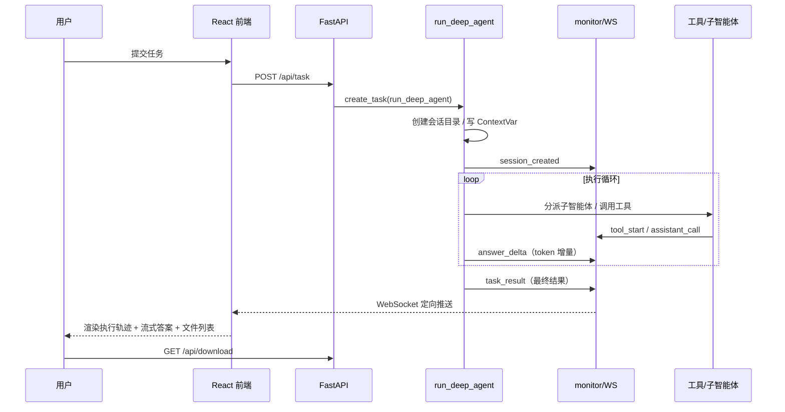

# 深度研搜系统架构设计

## 1. 系统定位

「深度研搜」是一个**对话式多智能体深度研究系统**：用户提交自然语言研搜任务，系统通过主智能体调度网络搜索、数据库查询、私有知识库三类专家助手完成多来源检索，汇总后生成 Markdown / PDF 交付物，并把执行过程实时推送到前端。

技术基座：`DeepAgents`（Orchestrator-Workers 模式）+ `LangGraph` 运行时 + `FastAPI/WebSocket` 服务层 + `React` 前端。

## 2. 分层架构

```text
┌──────────────────────────────────────────────────────────┐
│  前端层  React + Vite + Ant Design                        │
│  任务提交 / 事件流渲染 / 附件上传 / 文件下载 / 流式答案     │
└──────────────────────┬───────────────────────────────────┘
                       │ HTTP / WebSocket
┌──────────────────────▼───────────────────────────────────┐
│  接口层  app/api/server.py                                │
│  /api/task · /api/task/{id}/cancel · /api/upload          │
│  /api/files · /api/download · /ws/{thread_id}             │
│  后台任务注册表 active_tasks（同会话任务替换与取消）        │
└──────────────────────┬───────────────────────────────────┘
                       │ asyncio.create_task
┌──────────────────────▼───────────────────────────────────┐
│  调度层  run_deep_agent（app/agent/main_agent.py）         │
│  会话目录创建 · 上传文件复制 · ContextVar 上下文写入        │
│  astream(stream_mode=["updates","messages"]) 流式执行      │
└──────────────────────┬───────────────────────────────────┘
                       │ 模型节点 / task 工具调用
┌──────────────────────▼───────────────────────────────────┐
│  智能体层  DeepAgents                                     │
│  主智能体（规划 / 调度 / 汇总 / 文件交付）                 │
│   ├─ 网络搜索助手  internet_search                        │
│   ├─ 数据库查询助手  list_sql_tables / get_table_data /   │
│   │                    execute_sql_query                  │
│   └─ 知识库助手  list_knowledge_bases / ask_knowledge_base │
│  主智能体工具  read_file_content / generate_markdown /    │
│                convert_md_to_pdf                          │
└──────────────────────┬───────────────────────────────────┘
                       │ monitor.report_*
┌──────────────────────▼───────────────────────────────────┐
│  事件层  app/api/monitor.py + context.py                  │
│  ContextVar：thread_id / session_dir（会话级上下文隔离）   │
│  ConnectionManager：thread_id -> WebSocket 定向推送        │
└──────────────────────────────────────────────────────────┘
```

## 3. 多智能体调度

采用 DeepAgents 典型的 **Orchestrator-Workers** 模式：

1. 主智能体通过 `create_deep_agent` 组装：`model + 主提示词 + 3 个文件工具 + 3 个子智能体 + InMemorySaver 检查点`。
2. 子智能体以字典形式声明（`name / description / system_prompt / tools`），主智能体根据 `description` 决定任务分派。
3. DeepAgents 调用子智能体时在主智能体消息流中产生名为 `task` 的工具调用，其参数携带 `subagent_type` 与 `description`；调度层据此识别并向前端上报「正在调用哪个专家助手」。
4. `checkpointer` 以 `thread_id` 为键保存会话记忆，同一会话可复用上下文。

## 4. 会话级上下文隔离

- 每个任务分配 `thread_id`（同时也是 WebSocket 路由和会话目录名），工作目录为 `app/output/session_{thread_id}`。
- `ContextVar` 在 `run_deep_agent` 中写入 `session_dir` 与 `thread_id`，工具在深层调用中通过 `get_session_context()` / `get_thread_context()` 读取，避免层层传参；任务结束在 `finally` 中 reset，防止跨请求串台。
- 路径工具 `resolve_path` 统一清洗模型返回的虚拟/绝对/相对路径，把产物约束在当前会话目录内，防止路径越界。

## 5. WebSocket 事件链路

事件统一由 `ToolMonitor` 构造（`type: monitor_event`），经 `ConnectionManager` 按 `thread_id` 定向推送：

| 事件 | 触发点 | 前端用途 |
| --- | --- | --- |
| `session_created` | 会话目录创建 | 展示工作目录、驱动文件列表轮询 |
| `tool_start` | 任意工具被调用 | 展示当前执行到哪个工具及参数 |
| `assistant_call` | 主智能体分派子智能体 | 展示「正在调用哪个专家助手」 |
| `answer_delta` | 主智能体回答 token 增量 | 打字机式流式渲染最终答案 |
| `task_result` | 主智能体产出最终结果 | 设置最终回答（与流式内容一致，幂等） |
| `task_cancelled` | 用户取消任务 | 停止加载态 |
| `error` | 执行异常 | 展示错误信息 |

跨事件循环投递：`monitor` 可能运行在后台任务所在线程/循环，通过 `asyncio.run_coroutine_threadsafe` 把发送协程投递回 FastAPI 绑定的主循环（`manager.set_loop`）。

## 6. 流式回答（token 级）

- `run_deep_agent` 以 `stream_mode=["updates","messages"]` 驱动 `astream`。
  - `updates`：节点级状态（工具调用、子智能体调用、最终结果），维持原有解析逻辑。
  - `messages`：主智能体模型回答的 token 增量 `(message_chunk, metadata)`，仅当 `langgraph_node == "model"` 且无工具调用时推送 `answer_delta`，避免把工具参数流当作答案。
- 前端收到 `answer_delta` 后追加到 `result`，由 Markdown 渲染器增量渲染；`task_result` 到达时以完整结果兜底，二者幂等。

## 7. 文件交付

- 上传文件先落入 `app/updated/session_{id}`，任务启动时复制进 `output/session_{id}`，保证读文件工具与生成文件工具围绕同一工作目录。
- 主智能体通过 `read_file_content`（PDF/Word/Excel/Markdown 解析）、`generate_markdown`、`convert_md_to_pdf`（ReportLab 跨平台渲染）完成交付。
- 文件浏览/下载接口以 `output` 目录为安全边界，`resolve` 后校验相对关系，防止路径穿越。

## 8. 端到端时序



## 9. 部署形态

- **开发**：`uv run uvicorn app.api.server:app` + `pnpm dev`（Vite 代理 `/api`、`/ws`）。
- **生产**：`docker compose up --build` 拉起 `mysql + backend + frontend(Nginx)`；Nginx 托管前端静态产物并同源反代 `/api`、`/ws`（含 WebSocket Upgrade 头），后端通过 `env_file` 注入配置。
- **评测**：`uv run python -m evals.run_evals` 逐任务执行研搜，LLM-as-judge 打分并生成报告（见 `evals/README.md`）。
